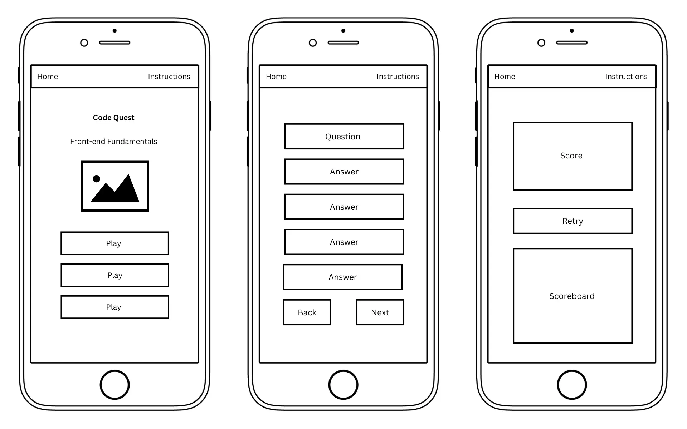
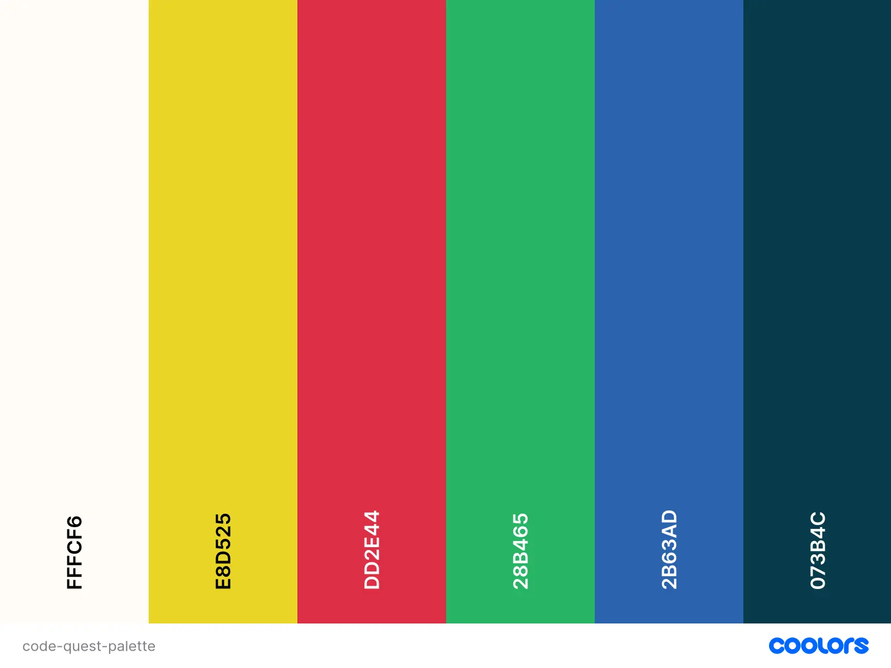

# Code Quest

## Introduction 

Code Quest is an engaging online quiz designed to test and enhance understanding of fundamental front-end web development concepts. The user can answer 10 multiple-choice questions about their chosen language and receive results on their performance. Code Quest is the result of a 3 day hackathon using HTML, CSS, and JavaScript by a team of developers:

* Luca Maxwell (Project Lead)
* Navya Keelara Nagaraju
* Kate Elliott

<a href="https://..." target="_blank">View the live project here.</a>

## Agile

...

## UX Design

#### Site Owner’s Goal

To create an engaging online quiz that helps beginner coders solidify their understanding of front-end web development languages through interactive quizzes. By providing immediate feedback and a fun learning experience, Code Quest aims to empower learners to build a strong foundation in HTML, CSS, and JavaScript.

### User Stories

The user stories for this project as well as their acceptance criteria and tasks can be found in the <a href="https://github.com/users/Luca-maxwell99/projects/4/views/1" target="_blank">project board</a>.

* As a beginner student, I want to select a quiz topic (HTML, CSS, or JavaScript) so that I can test my knowledge in a specific area.
* As a beginner student, I want to have a responsive design so that I can take the quiz on different devices like desktop, tablet, and mobile.
* As a beginner student, I want to answer 10 questions in the quiz so that I can evaluate my understanding of the topic.
* As a beginner student, I want to see my score at the end of the quiz so that I can know how well I did.
* As a beginner student, I want to have the option to try the quiz again so that I can improve my score and knowledge.
* As a beginner student, I want to switch between light and dark mode so that I can choose the theme that is comfortable for my eyes.
* As a beginner student, I want to see an instruction modal so that I can understand how to take the quiz.
* As a beginner student, I want to add my username so that I can personalize my quiz experience.
* As a student, I want to select the level of difficulty so that I can choose quiz questions that match my skill level.

### Wireframes

The wireframes for this project were created using Canva to map out the structure of the site on both mobile and desktop view. Doing so helped to guide the development of the site and how the quiz interface would best suit the user.

#### Mobile

#### Desktop

### Branding

#### Fonts

This project used 'Mulish' as the heading font and 'Space Mono' as the body font. Both of these are available via Google Fonts and there is a backup font of 'sans-serif'.

#### Colour Palette

The colour palette for Code Quest was chosen to create a visually appealing and user-friendly experience. The site offers both a light and dark mode within the colour palette to ensure the interface is easy on the eyes and accessible to a wide range of users. The charater's colours add a touch of personality to the design, while the core palette provides a clear and readable interface.

#### Imagery

All imagery for Code Quest came from Canva. The main graphic is of the Code Quest character for visual interest, and the other icons were kept simple to not complicate the site and have the quiz be the focus.

### Responsiveness

...

## Features
### Existing Features

#### Light and dark mode

...

#### Navigation

...

#### Game Start

...

#### Game Active

...

#### Game End

...

### Future Changes

* ...

## Technologies

### AI
...

## Testing

To ensure the success of the site there was testing and debugging carried out throughout the process both manually and with external tools. This process means that the site is now successfully deployed and has passed testing.

### Validator Testing
...

...

### JavaScript Testing
...

### Lighthouse

## Deployment

The site was deployed to GitHub pages. The steps to deploy are as follows:
* Go to the Settings tab of your GitHub repo.
* On the left-hand sidebar, in the Code and automation section, select Pages.
* Make sure the source is set to 'Deploy from Branch'.
* Make sure the main branch is selected.
* Make sure the folder is set to / (root).
* Under Branch, click Save.
* Go back to the Code tab and wait a few minutes before refreshing.
* On the right-hand side in the Deployments section click on 'github-pages'.
* The latest deployed link will appear at the top of the page.

<a href="..." target="_blank">View the live project here.</a>

## Credits
### Code
* ...

### Content
* ...

### Media
* All imagery was from Canva.